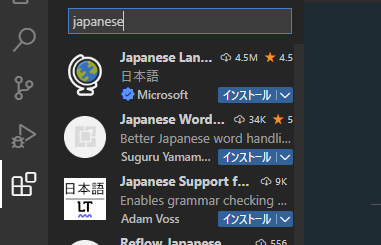

# VSCodeを使用してコーディングを行うための各種設定

エディタとしてVSCodeを使用します。

以下からダウンロードしてインストールしてください。

[Visual Studio Code – コード エディター](https://azure.microsoft.com/ja-jp/products/visual-studio-code/)

## まずはエディタを日本語化

エディタの拡張機能ボタンをクリックし、検索欄に「japanese」と入力します。

一番上に出てくる「japanese language pack」のインストールをクリックし、エディタを再起動すると日本語化されます。

