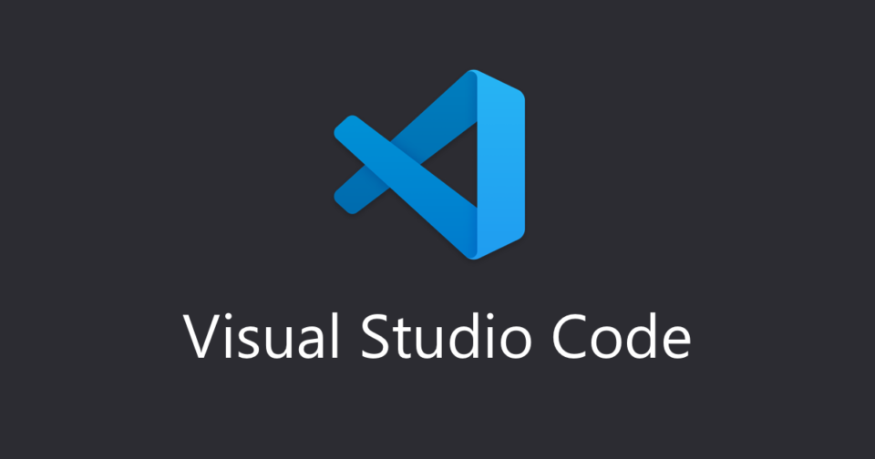

# VSCodeを使用してコーディングを行うための各種設定

  

エディタとしてVSCodeを使用します。

以下からダウンロードしてインストールしてください。

[Visual Studio Code – コード エディター](https://azure.microsoft.com/ja-jp/products/visual-studio-code/)

## まずはエディタを日本語化

エディタの拡張機能ボタンをクリックし、検索欄に「japanese」と入力します。

一番上に出てくる「japanese language pack」のインストールをクリックし、エディタを再起動すると日本語化されます。


## 導入する拡張機能

コーディングを便利にするため、下記の拡張機能を検索しインストールしてください。


* Live Server - 
  簡易的なローカルサーバーを立ち上げて、リアルタイムでブラウザ更新ができます。
  
* Prettier - 
  保存時に自動整形をしてくれるので、コードが見やすくなります。(Format On SaveとDefault Formatterの設定が必要)
 
* vscode-icons - 
  ファイルのアイコンを見やすくしてくれるので、ファイル管理などが行いやすくなります。
  
この他、導入したい拡張機能や配色テーマなどは自由にインストールしてください。

## Emmetを使って省略してコードを書く

Emmetを使えば、簡単にHTMLやCSSのコードを書くことができます。

例えば、HTML5の基本構文を出したいときは、HTMLファイル内で

```
!
```

を入力してTABキーを押すだけで

```html:index.html
<!DOCTYPE html>
<html lang="ja">
<head>
  <meta charset="UTF-8">
  <meta http-equiv="X-UA-Compatible" content="IE=edge">
  <meta name="viewport" content="width=device-width, initial-scale=1.0">
  <title>Document</title>
</head>
<body>
  
</body>
</html>
```
のコードが一瞬で入力できます。

Emmetは入力補完を行ってくれたり省略してコード書くことができるので、文字入力を最小限に抑えてスピーディにコーディングを行えます。  ただ、Emmetの記法は覚えられないくらいたくさんあるので、最初はチートシートを見ながらよく使うものを中心に覚えていくのがよいでしょう。

[Emmetチートシート](https://docs.emmet.io/cheat-sheet/)

## 拡張等参考リンク

- [【分野別】VSCodeのおすすめ拡張機能まとめ - Qiita](https://qiita.com/KNR109/items/5f933df1292564e6dc70)
- [【2022年】Web制作で使えるVSCodeオススメ拡張機能17選！ - PENGIN BLOG](https://pengi-n.co.jp/blog/vscode-extensions/)
- [Visual Studio Codeで見やすいテーマファイルのまとめ _ コリス](https://coliss.com/articles/build-websites/operation/work/best-of-visual-studio-code-themes.html)
- [【Visual Studio Code】可愛いテーマ集 – 8選 _ Pixel Note](https://neko11.com/vscode-cute-themes/)
